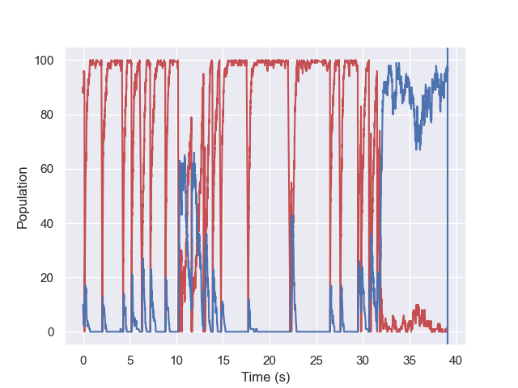
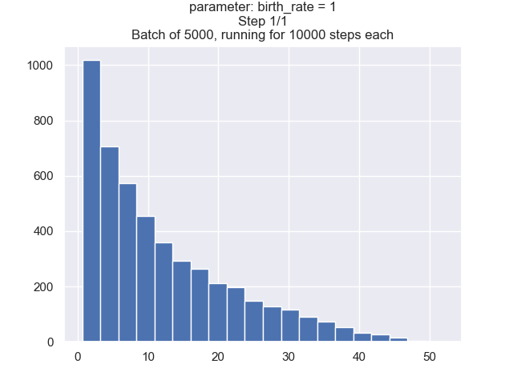
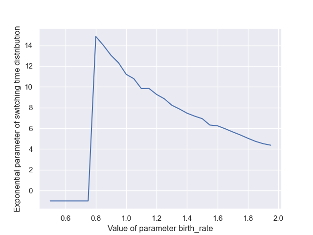

# methylation-modeling
This repository allows you to generate and analyze large batches of stochastic simulations of methylation behavior. Specifically, it focuses on measuring switching times between methylated and unmethylated states as various parameters are changed.

## Assumptions and Terminology
- All of these simulations use 100 sites (sometimes referred to as a "population" of 100). This count of sites does not change. Each of these sites is either Methylated, Hemimethylated, or Unmethylated. To simplify calculations, only Methylated and Unmethylated cell counts are tracked. Hemimethylated counts can be calculated as follows: 100 - (# of methylated cells + # of unmethylated cells).
- Familiarity with the Gillespie Algorithm is essential for using this package. This is why I've left the obsolete_algorithm folder - it contains the simple_algorithm folder, which is a very simple, generic version of the Gillespie algorithm that incorporates only births and deaths. Playing around with this simple program was how I familiarized myself with the Gillespie algorithm, and it might be a good start if the python implementation of the algorithm is confusing to you.
- 

## Components
Each folder is independant (doesn't use code from other folders) and does different things. Each of them uses an implementation of the Gillespie algorithm with the same **core logic**, but different **output methods**. 
- switching_times: performs many gillespie runs at once to get information about the time that it takes to switch from methylated to unmethylated and vice versa
    - Parameters
    - Output
    - Details: 
- switching_coordinates: performs many gillespie runs at once to find the average amount of methylation and unmethylation where switches happen. 
    - Parameters
    - Output
    - Details: Since a "switch" is recorded whenever 70% or more of the sites are either methylated or unmethylated, in practice this algorithm is measuring whichever category is not at 70%. For example, for a switch from hypo-to-hyper-methylated to actually count as a switch, there will always be 71 hyper-methylated sites; the number of **un**methylated sites will change, however, and the program measures this. The nature of cellular division causing large jumps in unmethylated sites will also be captured by this program.
- long_run: performs a single, very long, gillespie run to see what proportion of time is spent in each state (methylated, unmethylated, neither, or sort-of methylated*)
    - Parameters
    - Output
    - Details: *sort-of methylated refers to the condition of being less than 30% unmethylated, and less than 70% methylated. This condition represents the situation after cell division leaves a previously methylated cell with lots of hemimethylation but no fully methylated sites. Cells in this condition often quickly become methylated again, and thus a specific descriptor for them was desirable.

## Getting Started
- Make sure you have an IDE or code environment that can run the proper version of python, and have installed all needed packages (they are listed at the top of each file)
    - This code was developed in Python 3.12.1 64-bit, and library versions were current as of 8/20/2024.
- Decide which kind of information you are looking for, and open the corresponding folder: long run proportions, switching times, or switching coordinates. I will use the switching time folder for this example.
- Open the simulation file. You will make all your edits in this file, and it will automatically call the gillespie file when needed. You don't need to edit anything in the gillespie file!
- Edit your parameters in the first `Parameters` block.
    - for the parameter you're changing, input the beginning, end, and number of values. So if you want to test [0.8,0.9,1,1.1,1.2], you would input 0.8 for param_begin_val, 1.2 for param_end_val, and 5 for step_count
    - define your batch length and trial length - batch length is the amount of gillespie algorithms that will run for each value of the parameter, and trial length is the amount of steps after which each gillespie algorithm will "time out" and return an error.
    - define the starting methylation state (or initial condition) of your sites. This determines how many sites are methylated or unmethylated at the start of each gillespie run.
        - for the twoway_simulation program, you will need to edit the condition in two places. Use ctrl-f (or command-f on mac) to search for the text `edit here`, and set each initial condition separately.
        - for every other simulation program, you will set the initial condition only once, in the parameters block at the beginning.
- Edit your output metrics and graphs
    - TODO - make all this stuff work properly
    - TODO - edit the graphs to put graphs under useful headings, so people can disable what they want to
- Run the simulation program, and wait for the results! 

## Design
The simulation operates at 3 increasingly abstract levels of detail, each of which generates different graphs.
- Individual simulations, modeled by a single run of the **gillespieswitch.py** component
    - Automatically takes the parameters of a single run as input and runs the Gillespie algorithm until a switch occurs
    - Outputs the time taken to switch (that is, from methylated to unmethylated, or vice versa).
    - View graphs for this component by setting `debug = True`
    - 
- Batches of simulations with the same parameters, modeled by a single loop within the **simulation.py** program.
    - Automatically takes in parameters, and runs `batch_size` individual simulations 
    - Fits an exponential distribution to the distribution of their switching times
    - Outputs the parameter of that exponential distribution
    - View graphs for this component by setting `batch_debug = True`
    - 
- Comparison of switching times across multiple batches, modeled by a single run of **simulation.py**
    - **Manually** takes in a parameter and range of values (in the config section), and automatically runs a batch for each value in the range
    - Returns a visualization of how the exponential parameter of switching times changes relative to the chosen parameter
    - A single graph for this component is always displayed
    - 

## Example usage
**The only files the user should modify are the `#-----------parameterization-----------` section in simulation.py and the config.py file.**

Let's say the user wants to simulate 5000 runs of a simulation with the default methylation parameters and a maximum simulation length of 10,000 steps.   
Go to the `#-----------parameterization-----------` heading in simulation.py and change batch_size to 5000, and trial_max_length to 10000.  
Then set the initial condition of the simulation - by default, there are 100 sites, of which 90 are methylated and 10 unmethylated. This means the cell's **starting state is methylated -** so, it's probably most interesting to observe the switching times **to unmethylated.**  To do this, set SwitchDirection to -1 (or 1 to switch to methylated).  

This will run the code on a single parameter regime.  

After these parameters are adjusted to your liking, simply **run simulations.py** - it will handle everything else.

There are additional config parameters that allow users to vary a single parameter across a wide range of values (param_to_change, param_begin_val, param_end_val, param_step_size): the user will enter a range and step size, and the program will run a batch of simulations for each step in the range.

## Installation
At this time this code does not have a frontend: to run it you will need to open and run it with a code editor (like VSCode). If you don't have the correct Python libraries installed you may get some error messages - [Here is a guide to importing libraries and fixing those errors.](https://python.land/virtual-environments/installing-packages-with-pip)

## Notes for debugging / editing

## Acknowledgements
This repo represents work funded by a URS grant for the project  
"Stochastic Simulation of Transitions Between Methylation States"   
awarded 3/17/2024 with expected completion by 7/12/2024.  
**This project was supported by the University of Minnesota's Office of Undergraduate
Research.**