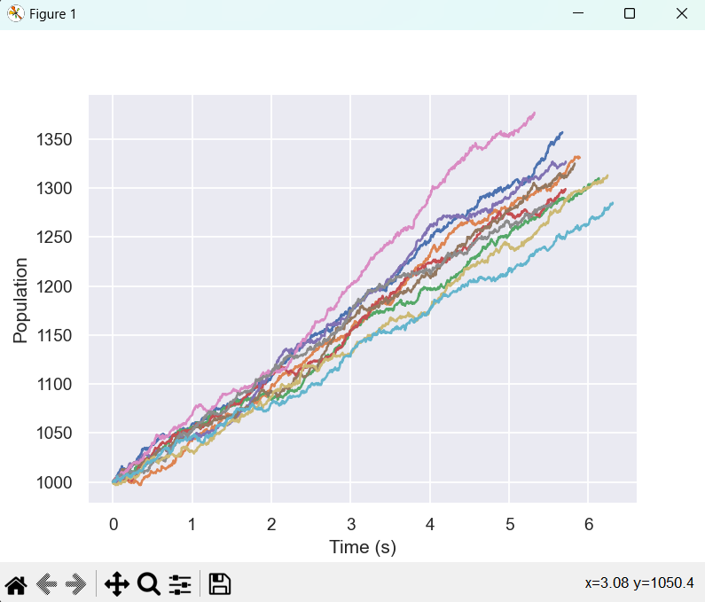

# methylation-modeling
At this time this code does not have a frontend: to run it you will need to open and run it with a code editor.

## Files
### gillespie-simplified
This is my first attempt at writing a gillespie algorithm in Python. It contains birth and death events for a single population.
### gillespie-simplified-oop
I rewrote my algorithm in Object-Oriented format, partly as an exercise and partly to make it easier to run large numbers of simulations. It contains birth and death events for a single population.  

All config information (rates of events happening and the effects of those events on the population) is in a seperate file: simplifiedconfig.py. Edits to this config file will be automatically reflected in the next run of gillespie-simplified-oop, as long as both files are in the same folder.

## Expected output
The gillespie-simplified algorithms generate a graph with their results, but don't yet save the data anywhere. An example of the expected output for a simulation run 10 times for 1000 steps, with population of 1000, birth rate of 0.1, and death rate of 0.05, is shown below.

## Acknowledgements
This repo represents work funded by a URS grant for the project  
`Stochastic Simulation of Transitions Between Methylation States`  
awarded 3/17/2024 with expected completion by 7/12/2024.  
**This project was supported by the University of Minnesota's Office of Undergraduate
Research.**